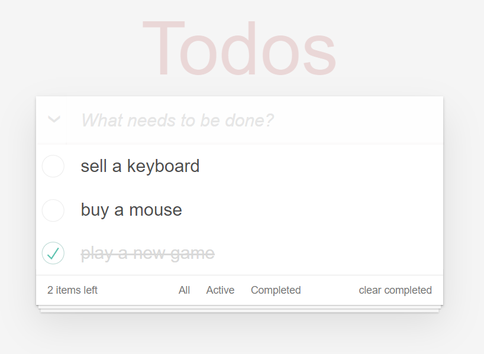

# A Todo app using ReactJS

<p align="center"></p>

### Todo with object structure using Redux (todoRedux branch)

### Todo object data structure (master branch)

```javascript
{
    1591513897340: {
        id: 1591513897340,
        content: "sell a keyboard",
        done: false,
    },
    1591513897341: {
        id: 1591513897341,
        content: "buy a mouse",
        done: false,
    },
    1591513897343: {
        id: 1591513897343,
        content: "play a new game",
        done: true,
    },
}
```

### Todo array data structure (todoArray branch)

```javascript
[
  {
    id: 1591513897340,
    content: "sell a keyboard",
    done: false,
  },
  {
    id: 1591513897341,
    content: "buy a mouse",
    done: false,
  },
  {
    id: 1591513897343,
    content: "play a new game",
    done: true,
  },
];
```
